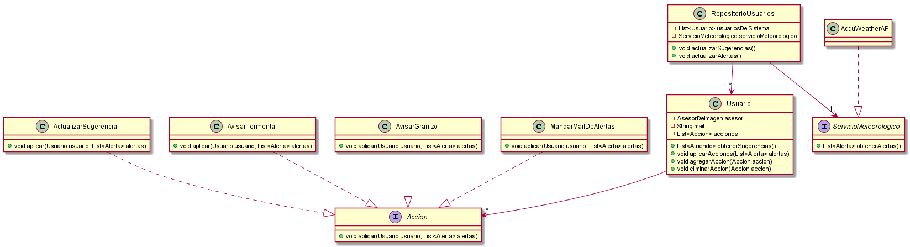

# Qué Me Pongo - Sexta iteración

## Diagrama de clases

---

## Seudocódigo

+ tambien se puede mirar [aca](https://github.com/AlejandroDeheza/QMP-VI/blob/master/seudocodigo.java)

~~~

class Usuario {
	AsesorDeImagen asesor;
    String mail;
    List<Accion> acciones;

	List<Atuendo> obtenerSugerencias(){
        return this.asesor.sugerirAtuendos();
    }

	void aplicarAcciones(List<Alerta> alertas){
        this.acciones.stream().ForEach(accion -> accion.aplicar(this, alertas));
    }

    void agregarAccion(Accion accion){
        this.acciones.add(accion);
    }
    
    void eliminarAccion(Accion accion){
        this.acciones.remove(accion);
    }
}

class RepositorioUsuarios {
    List<Usuario> usuariosDelSistema
    ServicioMeteorologico servicioMeteorologico

	void actualizarSugerencias(){
        this.usuariosDelSistema.obtenerSugerencias();
    }

	void actualizarAlertas(){
        List<alerta> alertas = this.servicioMeteorologico.obtenerAlertas();
        this.usuariosDelSistema.aplicarAcciones(alertas);
    }
}

interface ServicioMeteorologico {
	void List<Alerta> obtenerAlertas()
}

interface Accion {
	void aplicar(Usuario usuario, List<Alerta> alertas)
}

class ActualizarSugerencia{
    void aplicar(Usuario usuario, List<Alerta> alertas){
        usuario.obtenerSugerencias();
    }
}

class AvisarTormenta{
    void aplicar(Usuario usuario, List<Alerta> alertas){
        if(alertas.contains("STORM")){
            usuario.notificationService.notify("Hay tormentas, te recomendamos llevar paraguas");
        }
    }
}

class AvisarGranizo{
    void aplicar(Usuario usuario, List<Alerta> alertas){
        if(alertas.contains("HAIL")){
            usuario.notificationService.notify("Hay granizo, te recomendamos no salir en auto");
        }
    }
}

class MandarMailDeAlertas{
    void aplicar(Usuario usuario, List<Alerta> alertas){
        String mail = usuario.getMail();
        enviar(mail, alertas);
    }
}

~~~